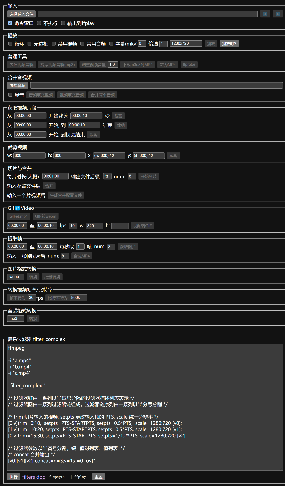

## 处理视频/音频/图片的简单工具

- [ffmpeg](https://ffmpeg.org/)
- 下载[ffmpeg.exe](https://github.com/BtbN/FFmpeg-Builds/releases)(lgpl.zip)，然后将bin目录添加到PATH环境变量，bin目录下通常有ffplay,ffmpeg,ffproge三个可执行文件

## dev
```
vim ~/.npmrc
```

```
ELECTRON_MIRROR="https://npmmirror.com/mirrors/electron/"
ELECTRON_CUSTOM_DIR="{{ version }}"
```

```
npm i
npm start
```

## build

```
npm run make
```


